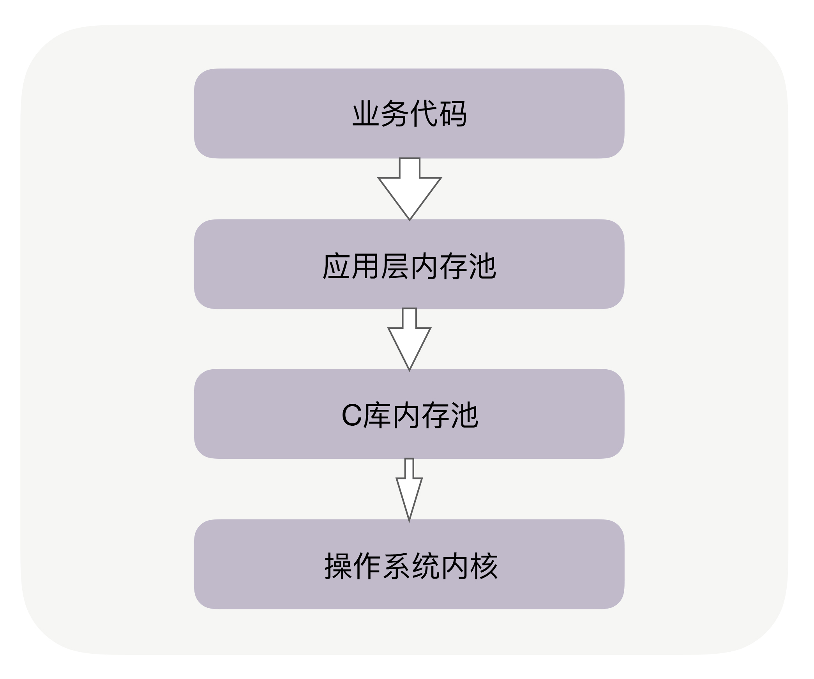
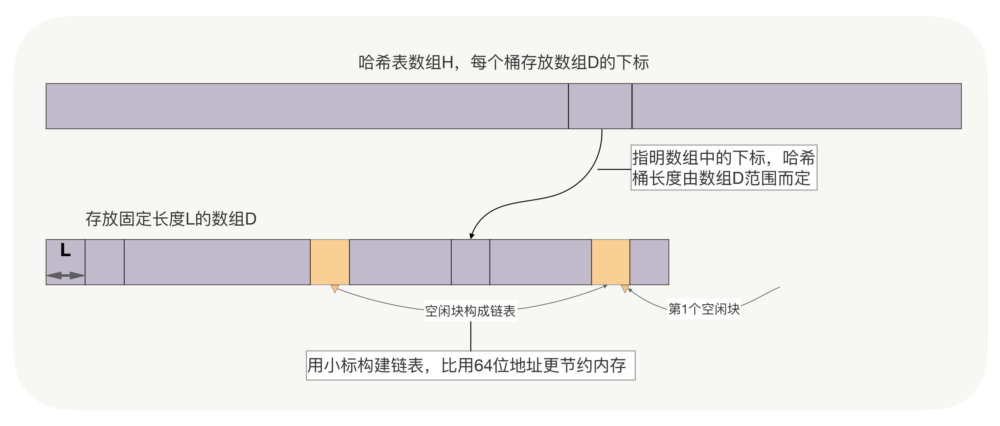
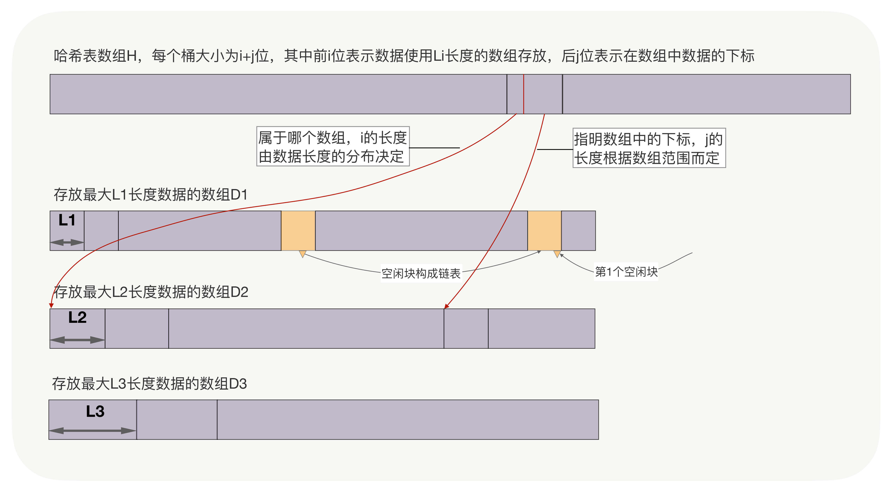
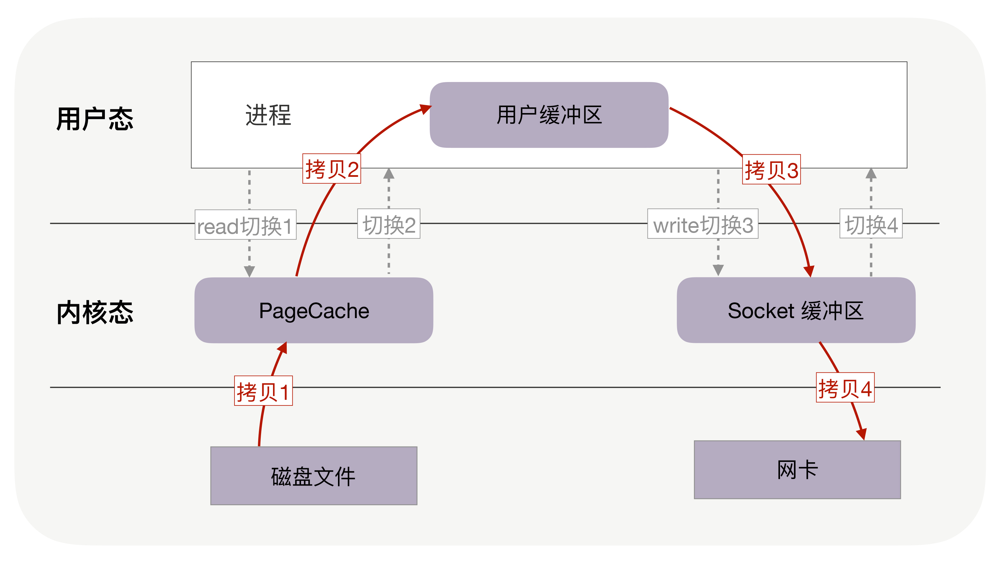
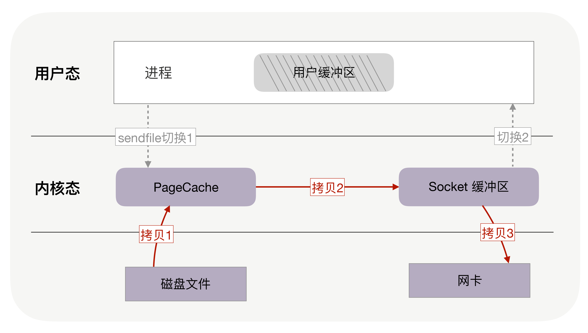
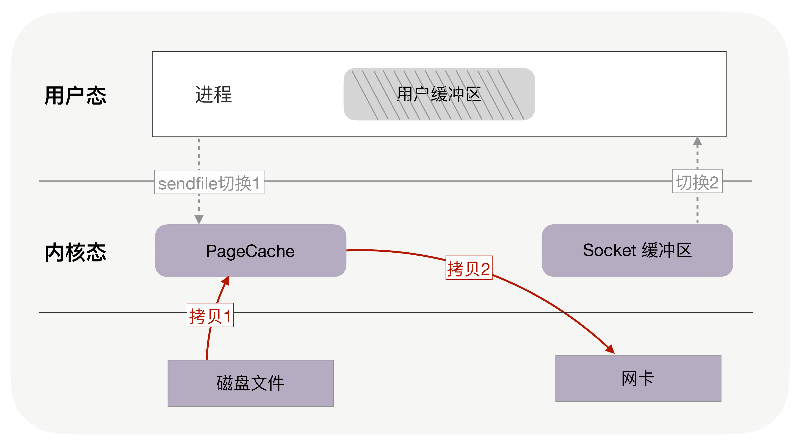
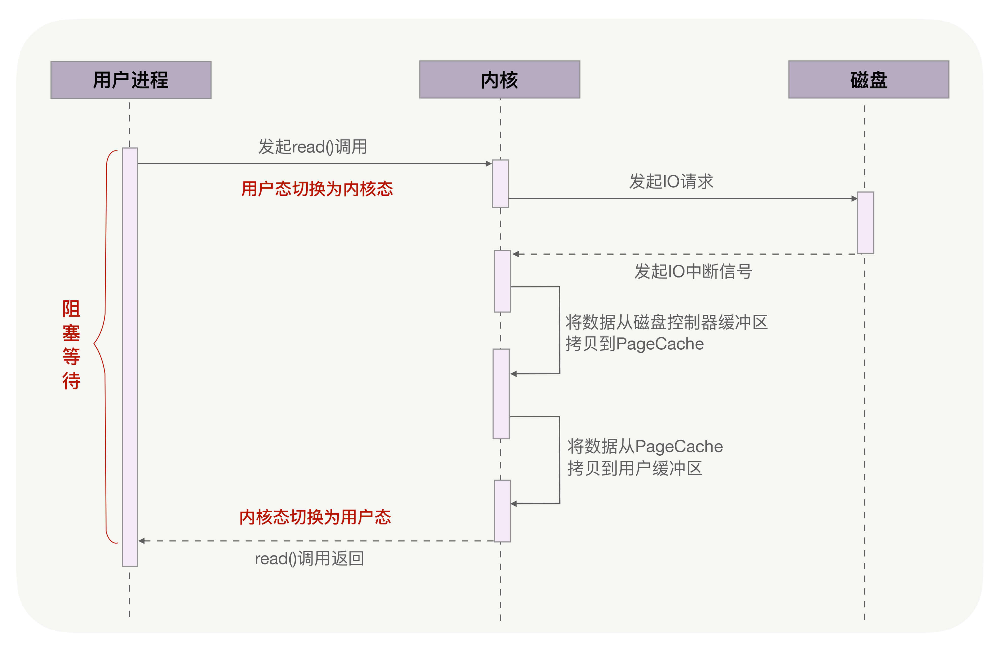
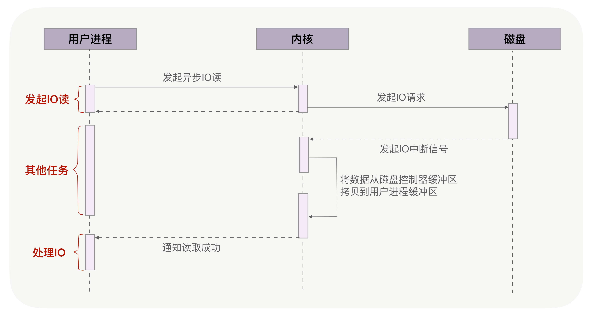
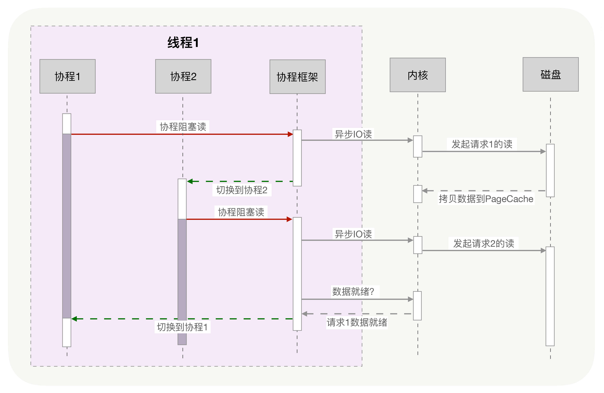

# 基础设施优化

## 01 | CPU缓存：怎样写代码能够让CPU执行得更快？

### 提升数据缓存的命中率

访问数组元素，哪一个更快？

```cpp
for(i = 0; i < N; i+=1) {
	for(j = 0; j < N; j+=1) {
        array[i][j] = 0;
    }
}

for(i = 0; i < N; i+=1) {
	for(j = 0; j < N; j+=1) {
        array[j][i] = 0;
    }
}
```

回答这个问题有几个要点：

1. 数组存储通常是按行存储的

2. 假设`cpu`的`cache`每次读入缓存块是64字节，每个元素是8字节，那么按行优先顺序访问只有第一次会`miss`，后面7次都会命中。而按列优先顺序访问，因为数组存储不是按列存储的，所以每次访问都会`miss`
3. 可以使用`Perf`工具直观地验证缓存命中的情况，执行` perf stat `可以统计出进程运行时的系统信息（通过 -e 选项指定要统计的事件，如果要查看三级缓存总的命中率，可以指定缓存未命中` cache-misses` 事件，以及读取缓存次数 `cache-references `事件，两者相除就是缓存的未命中率，用 1 相减就是命中率。类似的，通过` L1-dcache-load-misses `和` L1-dcache-loads `可以得到 L1 缓存的命中率），此时你会发现 `array[i][j]`的缓存命中率远高于`array[j][i]`。

### 提升指令缓存的命中率

```c++
int array[N];
for (i = 0; i < TESTN; i++) array[i] = rand() % 256;
```

对上述数组进行两个操作：一是循环遍历数组，判断每个数字是否小于 `128`，如果小于则把元素的值置为 `0`；二是将数组排序。那么，先排序再遍历速度快，还是先遍历再排序速度快呢？

答案：**先排序的遍历时间只有后排序的三分之一。这是因为循环中有大量的 if 条件分支，而 CPU含有分支预测器。**

当数组中的元素完全随机时，分支预测器无法有效工作，而当 array 数组有序时，分支预测器会动态地根据历史命中数据对未来进行预测，命中率就会非常高。

C/C++ 语言中编译器还给应用程序员提供了显式预测分支概率的工具，如果 if 中的条件表达式判断为“真”的概率非常高，我们可以用 likely 宏把它括在里面，反之则可以用 unlikely 宏。当然，CPU 自身的条件预测已经非常准了，仅当我们确信 CPU 条件预测不会准，且我们能够知晓实际概率时，才需要加入这两个宏。

```c++
#define likely(x) __builtin_expect(!!(x), 1) 
#define unlikely(x) __builtin_expect(!!(x), 0)
if (likely(a == 1)) …
```

### 提升多核 CPU 下的缓存命中率

若进程 A 在时间片 1 里使用 CPU 核心 1，自然也填满了核心 1 的一、二级缓存，当时间片 1 结束后，操作系统会让进程 A 让出 CPU，基于效率并兼顾公平的策略重新调度 CPU 核心 1，以防止某些进程饿死。如果此时 CPU 核心 1 繁忙，而 CPU 核心 2 空闲，则进程 A 很可能会被调度到 CPU 核心 2 上运行，这样，即使我们对代码优化得再好，也只能在一个时间片内高效地使用 CPU 一、二级缓存了，下一个时间片便面临着缓存效率的问题。

因此操作系统提供了将进程或者线程绑定到某一颗 CPU 上运行的能力。如 Linux 上提供了 `sched_setaffinity` 方法实现这一功能，其他操作系统也有类似功能的 API 可用。**当多线程同时执行密集计算，且 CPU 缓存命中率很高时，如果将每个线程分别绑定在不同的 CPU 核心上，性能便会获得非常可观的提升。**

### 小结

CPU 缓存分为数据缓存与指令缓存。

对于数据缓存，我们应在循环体中尽量操作同一块内存上的数据，由于缓存是根据 CPU Cache Line 批量操作数据的，所以顺序地操作连续内存数据时也有性能提升。

对于指令缓存，有规律的条件分支能够让 CPU 的分支预测发挥作用，进一步提升执行效率。对于多核系统，如果进程的缓存命中率非常高，则可以考虑绑定 CPU 来提升缓存命中率。

## 02 | 内存池：如何提升内存分配的效率？



Google 的 `TCMalloc` 和 `FaceBook` 的 `JEMalloc`，它们也是 C 库内存池。当 C 库内存池无法满足内存申请时，才会向操作系统内核申请分配内存。

C 库内存池工作时，会预分配比你申请的字节数更大的空间作为内存池。比如说，当主进程下申请 1 字节的内存时，Ptmalloc2 会预分配 132K 字节的内存（Ptmalloc2 中叫 Main Arena），应用代码再申请内存时，会从这已经申请到的 132KB 中继续分配。

### 选择 Ptmalloc2 还是 TCMalloc？

`TCMalloc`适用的场景，它对**多线程下小内存**的分配特别友好。

Ptmalloc2 更擅长大内存的分配。

Ptmalloc2 假定，如果线程 A 申请并释放了的内存，线程 B 可能也会申请类似的内存，所以它允许内存池在线程间复用以提升性能。

每次分配内存，Ptmalloc2 一定要加锁，才能解决共享资源的互斥问题。然而，加锁的消耗并不小。如果你监控分配速度的话，会发现单线程服务调整为 100 个线程，Ptmalloc2 申请内存的速度会变慢 10 倍。TCMalloc 针对小内存做了很多优化，每个线程独立分配内存，无须加锁，所以速度更快！

多少字节叫小内存呢？TCMalloc 把内存分为 3 个档次，

小内存：[0,256KB]

中等内存：[256kb,1M]

大内存：[1M,~]

`TCMalloc` 对中等内存、大内存的分配速度很慢。

### 为什么栈上分配速度快？

由于每个线程都有独立的栈，所以分配内存时不需要加锁保护，而且栈上对象的尺寸在编译阶段就已经写入可执行文件了，执行效率更高！性能至上的` Golang` 语言就是按照这个逻辑设计的，即使你用 new 关键字分配了堆内存，但编译器如果认为在栈中分配不影响功能语义时，会自动改为在栈中分配。

为什么不全用栈分配内存呢？

在栈中分配内存也有缺点，它有功能上的限制。一是， 栈内存生命周期有限，它会随着函数调用结束后自动释放，在堆中分配的内存，并不随着分配时所在函数调用的结束而释放，它的生命周期足够使用。二是，栈的容量有限

### 小结

不同的 C 库内存池，都有它们最适合的应用场景，例如 `TCMalloc `对多线程下的小内存分配特别友好，而 Ptmalloc2 则对各类尺寸的内存申请都有稳定的表现，更加通用。

## 03 | 索引：如何用哈希表管理亿级对象？

### 内存结构与序列化方案

1. 链接法，落到数组同一个位置中的多个数据，通过链表串在一起。使用哈希函数查找到这个位置后，再使用链表遍历的方式查找数据。Java 标准库中的哈希表就使用链接法解决冲突。
2. 开放寻址法，插入时若发现对应的位置已经占用，或者查询时发现该位置上的数据与查询关键字不同，开放寻址法会按既定规则变换哈希函数（例如哈希函数设为` H(key,i)`，顺序地把参数` i `加 1），计算出下一个数组下标，继续在哈希表中探查正确的位置。

我们该选择哪种方法呢？——开放地址法适用于亿级对象

由于生产级存放大量对象的哈希表是需要容灾的，比如每隔一天把哈希表数据定期备份到另一台服务器上。当服务器宕机而启动备用服务器时，首先可以用备份数据把哈希表恢复到 1 天前的状态，再通过操作日志` oplog `把 1 天内的数据载入哈希表，这样就可以最快速的恢复哈希表。所以，为了能够传输，首先必须把**哈希表序列化**。

链接法虽然实现简单，还允许存放元素个数大于数组的大小（也叫装载因子大于 1），但链接法序列化数据的代价很大，因为**使用了指针后，内存是不连续的**。

如果能将数据完整的放进数组，那么开放寻址法已经解决了序列化问题，所以我们应该选择开放寻址法。

有两个因素使得我们必须把数据放在哈希桶之外：

1. 每条数据有上百字节；

2. 哈希表中一定会有很多空桶（没有存放数据）。空桶的比例越高（装载因子越小），冲突概率也会越低，但如果每个空桶都占用上百字节，亿级规模会轻松把浪费的内存放大许多倍。

所以，我们要把数据从哈希表中分离出来，提升哈希表的灵活性（灵活调整装载因子）。此时，该如何序列化哈希表以外的数据呢？最快速的序列化方案，还是像开放寻址法的散列表一样，使用定长数组存放对象，通过原地映射文件的方式序列化数据。由于数据未必是定长的，所以又分为两种情况。

**一、数据的长度是固定的。**可以用另一个数组 D 存放数据，其中 D 的大小是待存放元素的最大数量，注意，D 可以远小于哈希数组的大小。如果哈希表是动态的，支持新建与删除元素操作，还需要把数组 D 中空闲的位置构建一个单链表，新建时从链表头取元素，删除时将元素归还至链表头部。



**二、数据的长度并不固定。**此时，可以采用有限个定长数组存放数据，用以空间换时间的思想，加快访问速度。如下图中，D1 数组存放长度小于 L1 的数据，D2 数组存放长度在 L1 和 L2 之间的数据，以此类推。而哈希表数组 H 中，每个桶用`i `位存放该数据在哪个数组中，用 j 位存放数组下标。查找数据时，前 i 位寻找数组，后 j 位作为数组下标直接访问数据。



在这两种情况里，哈希桶不需要存放 8 字节 64 位的地址。因为，或许数组 D 的大小不到 1 亿，也就是说，你最多只需要寻址 1 亿条数据，这样 30 位足够使用。要知道，减少哈希桶的尺寸，就意味着同等内存下可以扩大哈希数组，从而降低装载因子。

### 降低哈希表的冲突概率

减少冲突概率有两个办法，第一个办法是调优哈希函数，第二个办法就是扩容。

扩容需要新老哈希表同时存在，通过遍历全部数据，用新的哈希函数把关键字放到合适的新哈希桶中。可见，扩容是一个极其耗时的操作，尤其在元素以亿计的情况下。那么，在耗时以小时计的扩容过程中，如何持续提供正常服务呢？

其实，只要把一次性的迁移过程，分为多次后台迁移，且提供服务时能够根据迁移情况选择新老哈希表即可。如果单机内存可以存放下新老两张哈希表，那么动态扩容不需要跨主机。反之，扩容过程将涉及新老哈希表所在的两台服务器，实现更为复杂，但原理是相同的。

## 04 | 零拷贝：如何高效地传输文件？

针对磁盘的优化技术层出不穷，比如零拷贝、直接 IO、异步 IO 等等。这些优化技术为了降低操作时延、提升系统的吞吐量，围绕着内核中的磁盘高速缓存（也叫 `PageCache`），去减少 CPU 和磁盘设备的工作量。

### 如何实现文件传输？



这个方案性能并不好，主要有两个原因。

1. 首先，**它至少经历了 4 次用户态与内核态的上下文切换**。因为每处理一次消息，就需要一次 read 调用和一次 write 调用，每次系统调用都得先从用户态切换到内核态，等内核完成任务后，再从内核态切换回用户态。上下文切换的成本并不小，虽然一次切换仅消耗几十纳秒到几微秒，但高并发服务会放大这类时间的消耗。

2. 其次，**这个方案做了 4 次内存拷贝**。

### 零拷贝如何提升文件传输性能？

因为在把磁盘文件发到网络的场景中，**用户缓冲区没有必须存在的理由**。

如果内核在读取文件后，直接把 `PageCache` 中的内容拷贝到 `Socket `缓冲区，待到网卡发送完毕后，再通知进程，这样就只有 2 次上下文切换，和 3 次内存拷贝。



如果网卡支持 SG-DMA（The Scatter-Gather Direct Memory Access）技术，还可以再去除 Socket 缓冲区的拷贝，这样一共只有 2 次内存拷贝。



它是操作系统提供的新函数，同时接收文件描述符和 TCP socket 作为输入参数，这样执行时就可以完全在内核态完成内存拷贝，既减少了内存拷贝次数，也降低了上下文切换次数。而且，零拷贝取消了用户缓冲区后，不只降低了用户内存的消耗，还通过最大化利用 socket 缓冲区中的内存，间接地再一次减少了系统调用的次数，从而带来了大幅减少上下文切换次数的机会！

### `PageCache`，磁盘高速缓存

读取文件时，是先把磁盘文件拷贝到 `PageCache` 上，再拷贝到进程中。为什么这样做呢？有两个原因所致。

1. 选择热点数据，时间局部性原理；磁盘比内存的速度慢许多，内存空间远比磁盘要小，内存中注定只能复制一小部分磁盘中的数据。选择哪些数据复制到内存呢？通常，刚被访问的数据在短时间内再次被访问的概率很高（这也叫“时间局部性”原理），用 `PageCache` 缓存最近访问的数据，当空间不足时淘汰最久未被访问的缓存（即 LRU 算法）。读磁盘时优先到 `PageCache` 中找一找，如果数据存在便直接返回，这便大大提升了读磁盘的性能。
2. 预读功能；读取磁盘数据时，需要先找到数据所在的位置，对于机械磁盘来说，就是旋转磁头到数据所在的扇区，再开始顺序读取数据。其中，旋转磁头耗时很长，为了降低它的影响，`PageCache` 使用了预读功能。虽然 read 方法只读取了 0-32KB 的字节，但内核会把其后的 32-64KB 也读取到 `PageCache`，这后 32KB 读取的成本很低。如果在 32-64KB 淘汰出 `PageCache` 前，进程读取到它了，收益就非常大。这一讲的传输文件场景中这是必然发生的。

**在某些情况下，`PageCache` 会不起作用，甚至由于多做了一次内存拷贝，造成性能的降低。**

由于文件太大，文件中某一部分内容被再次访问到的概率其实非常低。这带来了 2 个问题：首先，由于 `PageCache` 长期被大文件占据，热点小文件就无法充分使用 `PageCache`，它们读起来变慢了；其次，`PageCache` 中的大文件没有享受到缓存的好处，但却耗费 CPU（或者 DMA）多拷贝到 `PageCache` 一次。


### 异步 IO + 直接 IO

高并发场景处理大文件时，应当使用异步 IO 和直接 IO 来替换零拷贝技术。

传统方法，当调用 read 方法读取文件时，实际上 read 方法会在磁盘寻址过程中阻塞等待，导致进程无法并发地处理其他任务。



异步 IO（异步 IO 既可以处理网络 IO，也可以处理磁盘 IO，这里我们只关注磁盘 IO）可以解决阻塞问题。它把读操作分为两部分，前半部分向内核发起读请求，但不等待数据就位就立刻返回，此时进程可以并发地处理其他任务。当内核将磁盘中的数据拷贝到进程缓冲区后，进程将接收到内核的通知，再去处理数据，这是异步 IO 的后半部分。如下图所示：



从图中可以看到，**异步 IO 并没有拷贝到 `PageCache 中`**，这其实是异步 IO 实现上的缺陷。经过 `PageCache` 的 IO 我们称为缓存 IO，它与虚拟内存系统耦合太紧，导致异步 IO 从诞生起到现在都不支持缓存 IO。

绕过 `PageCache` 的 IO 是个新物种，我们把它称为直接 IO。对于磁盘，异步 IO 只支持直接 IO。

直接 IO 的应用场景并不多，主要有两种：

第一，应用程序已经实现了磁盘文件的缓存，不需要 `PageCache` 再次缓存，引发额外的性能消耗。比如 MySQL 等数据库就使用直接 IO；

第二，高并发下传输大文件，我们上文提到过，大文件难以命中 `PageCache` 缓存，又带来额外的内存拷贝，同时还挤占了小文件使用 `PageCache` 时需要的内存，因此，这时应该使用直接 IO。

当然，直接 IO 也有一定的缺点。除了缓存外，内核（IO 调度算法）会试图缓存尽量多的连续 IO 在 `PageCache` 中，最后合并成一个更大的 IO 再发给磁盘，这样可以减少磁盘的寻址操作；另外，内核也会预读后续的 IO 放在 `PageCache` 中，减少磁盘操作。直接 IO 绕过了 `PageCache`，所以无法享受这些性能提升。

有了直接 IO 后，异步 IO 就可以无阻塞地读取文件了。现在，大文件由异步 IO 和直接 IO 处理，小文件则交由零拷贝处理，至于判断文件大小的阈值可以灵活配置（参见 Nginx 的 `directio` 指令）。

### 小结

**针对大文件使用异步 IO 和直接 IO，而对小文件使用零拷贝。**

## 05 | 协程：如何快速地实现高并发服务？

**多进程的优缺点：**

优点：比较稳定，因为不共享地址空间

缺点：一是内核的管理成本高，二是无法简单地通过内存同步数据，很不方便。

**多线程的优缺点：**

多线程共享地址空间，

缺点：任何一个线程出错时，进程中的所有线程会跟着一起崩溃。这也是`nginx`等强调稳定性的服务坚持使用多进程模式的原因。

无论多进程还是多线程，都难以实现高并发，原因有两个：

1. 占用内存大。单个线程消耗的内存过多，比如64位的`linux`为每个线程的栈分配8MB的内存，还预分配64MB的内存作为堆内存池
2. 切换上下文的成本太大

### 协程是如何实现高并发的？
1. 协程把异步化中的两段函数，封装为一个阻塞的协程函数。这个函数执行时会调用它的协程无感知地（内核无感知）放弃执行权，由协程框架切换到其他就绪的协程继续执行。当这个函数的结果满足后，协程框架再选择合适的时机切换回来。协程必须重新封装所有的阻塞系统调用，比如sleep函数会让当前线程休眠，由内核唤醒，而协程中，sleep只会让当前协程休眠，由协程框架在指定时间后唤醒协程。
2. 协程栈的大小通常只有几十 KB



异步化是通过回调函数来完成请求切换的，业务逻辑与并发实现关联在一起，很容易出错。协程不需要什么“回调函数”，它允许用户调用“阻塞的”协程方法，用同步编程方式写业务逻辑。

**实际上，用户态的代码切换协程，与内核切换线程的原理是一样的。**内核通过管理 CPU 的寄存器来切换线程，我们以最重要的栈寄存器和指令寄存器为例，看看协程切换时如何切换程序指令与内存。

**协程将异步的注册回调函数以及非阻塞的系统调用来封装成一个阻塞的协程，即将等待回调时通过线程中的上下文切换来实现线程的无感知切换,感觉有点类似于异步阻塞,但阻塞是用户态的,也就是是由用户态来进行线程的虚拟的休眠(通过线程上下文的切换)**

## 06 | 锁：如何根据业务场景选择合适的锁？

### 四种IO模型

1. 同步阻塞: 调用了阻塞的系统调用,内核会将线程置于休眠状态,并进行调度 

2. 同步非阻塞: 调用了非阻塞的系统调用,系统调用会立刻返回结果.通过重试的方式来不断获取结果,直到满足条件
3. 异步阻塞:  会通过注册回调函数来实现结果的通知,注册完成线程会被内核挂起进入休眠状态
4. 异步非阻塞: 同上,但注册完成后线程可以继续执行

### 读写锁

读写锁真正发挥优势的场景，必然是读多写少的场景，否则读锁将很难并发持有。

能否兼顾二者，避免读、写线程饿死呢？用队列把请求锁的线程排队，按照先来后到的顺序加锁即可，当然读线程仍然可以并发，只不过不能插队到写线程之前。

### 乐观锁：不使用锁也能同步

无论互斥锁、自旋锁还是读写锁，都属于悲观锁。它认为同时修改资源的概率很高，很容易出现冲突，所以访问共享资源前，先加上锁，总体效率会更优。然而，如果并发产生冲突的概率很低，就不必使用悲观锁，而是使用乐观锁。

所谓“乐观”，就是假定冲突的概率很低，所以它采用的“加锁”方式是，先修改完共享资源，再验证这段时间内有没有发生冲突。如果没有其他线程在修改资源，那么操作完成。如果发现其他线程已经修改了这个资源，就放弃本次操作。

### 自旋锁的使用场景

**自旋锁适用于计算量小的代码段**，性能会更好，而mutex加锁失败后会进入睡眠，有切换开销。

自旋锁比互斥锁快得多，因为它通过 CPU 提供的 CAS 函数（全称 Compare And Swap），在**用户态**代码中完成加锁与解锁操作。

